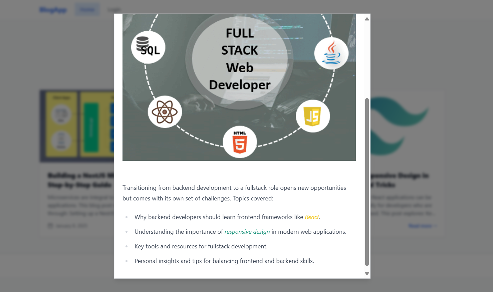
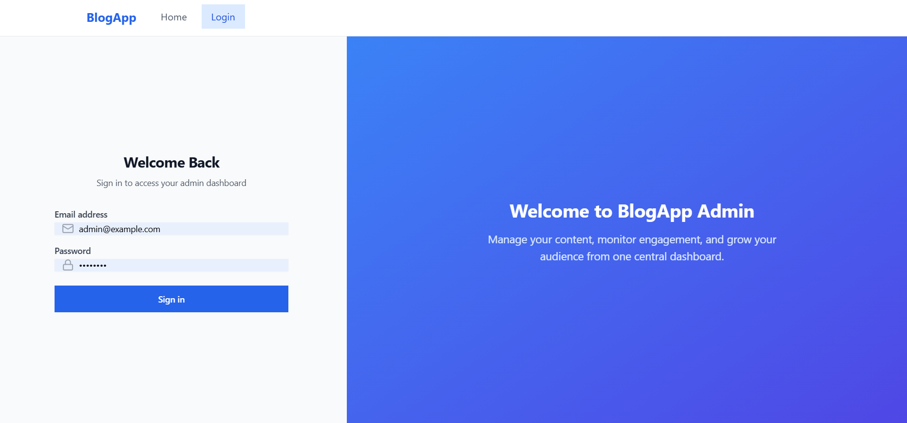
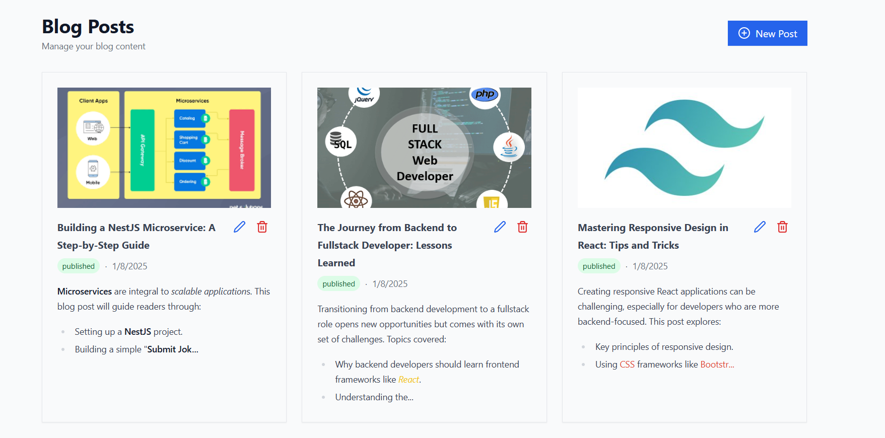
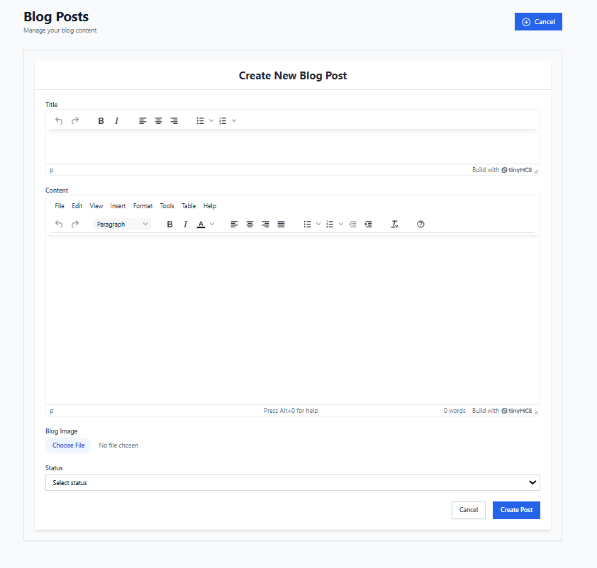

# Blog Platform

A full-stack blog platform featuring an admin panel for content management and a responsive user interface. Built with modern web technologies, supporting authentication, CRUD operations, and a clean separation between admin and user experiences.

## Features

- **Authentication & Authorization**
  - Cookie-based authentication system
  - Secure admin panel access
  - Protected API endpoints

- **Admin Panel**
  - Create new blog posts with rich text editor (TinyMCE)
  - Edit existing posts
  - Delete posts
  - Image upload support via Cloudinary

- **User Interface**
  - Browse published blog posts
  - View detailed post content
  - Responsive design
  - Clean and intuitive interface

## Technology Stack

### Frontend (web)
- React with TypeScript
- Vite as build tool
- Tailwind CSS for styling
- TinyMCE for rich text editing

### Backend (api)
- NestJS framework
- MySQL database
- Swagger for API documentation
- Jest for unit testing

## Interface Previews

Home panel  


Blog post card  


Login panel  


Dashboard panel  


Add blog post panel  



## Prerequisites

- Node.js
- MySQL
- npm package manager

## Project Structure

```
blog-platform/
├── api/                # NestJS backend
├── web/                # React frontend
├── blog-platform.postman_collection.json
└── README.md
```

## Environment Configuration

### Backend (.env)
```
PORT                   # API server port (default: 3004)
NODE_ENV               # Environment (development/production)
MYSQL_HOST             # MySQL database host
MYSQL_PORT             # MySQL database port
MYSQL_USERNAME         # MySQL username
MYSQL_PASSWORD         # MySQL password
MYSQL_DATABASE         # MySQL database name
JWT_SECRET             # Secret key for JWT token generation
CLOUDINARY_CLOUD_NAME  # Cloudinary cloud name for image uploads
CLOUDINARY_API_KEY     # Cloudinary API key
CLOUDINARY_API_SECRET  # Cloudinary API secret
```

### Frontend (.env)
```
VITE_TINYMCE_API_KEY   # TinyMCE editor API key
```

## Installation & Setup

1. Clone the repository
```bash
git clone <https://github.com/Harshan-Pradeep/blog-flatform.git>
cd blog-platform
```

2. Backend Setup
```bash
cd api
npm install
# Configure your .env file based on the template above
npm run start:dev
```

3. Frontend Setup
```bash
cd web
npm install
# Configure your .env file
npm run dev
```

## API Documentation

The API documentation is available via Swagger UI at:
```
http://localhost:3004/api-docs/#/
```

## Testing

### Backend Tests
```bash
cd api
# Run unit tests
npm run test

# Run e2e tests
npm run test:e2e

# Generate test coverage
npm run test:cov
```

## Development

### Backend Development
```bash
cd api
# Start in development mode
npm run start:dev

# Start in production mode
npm run start:prod
```

### Frontend Development
```bash
cd web
npm run dev
```
